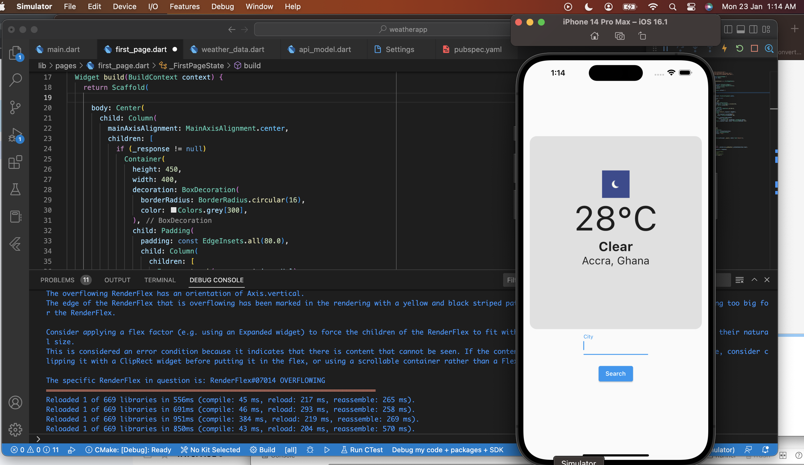

# weatherapp

A new Flutter project.

Simple weather app. 

The app let you do the following:
1. make http get requests to an api, using input on the textfield
2. data models to handle http responses
3. mapped the responses to the data models
4. display response to ui

Here is a screenshot of the app

## Getting Started

This project is a starting point for a Flutter application.

A few resources to get you started if this is your first Flutter project:

- [Lab: Write your first Flutter app](https://docs.flutter.dev/get-started/codelab)
- [Cookbook: Useful Flutter samples](https://docs.flutter.dev/cookbook)

For help getting started with Flutter development, view the
[online documentation](https://docs.flutter.dev/), which offers tutorials,
samples, guidance on mobile development, and a full API reference.
